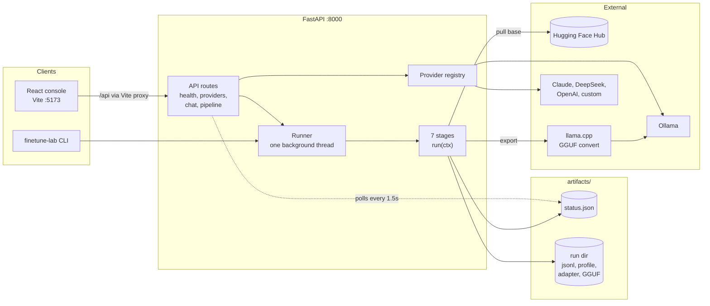
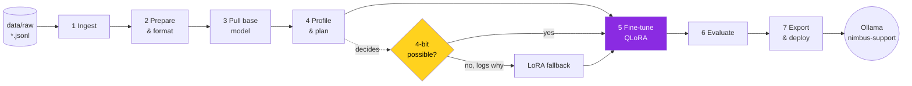
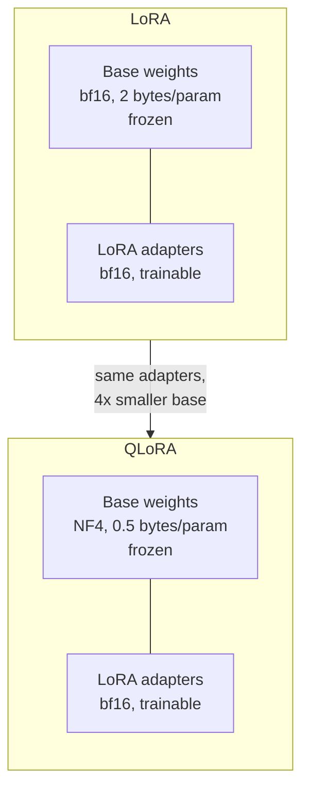
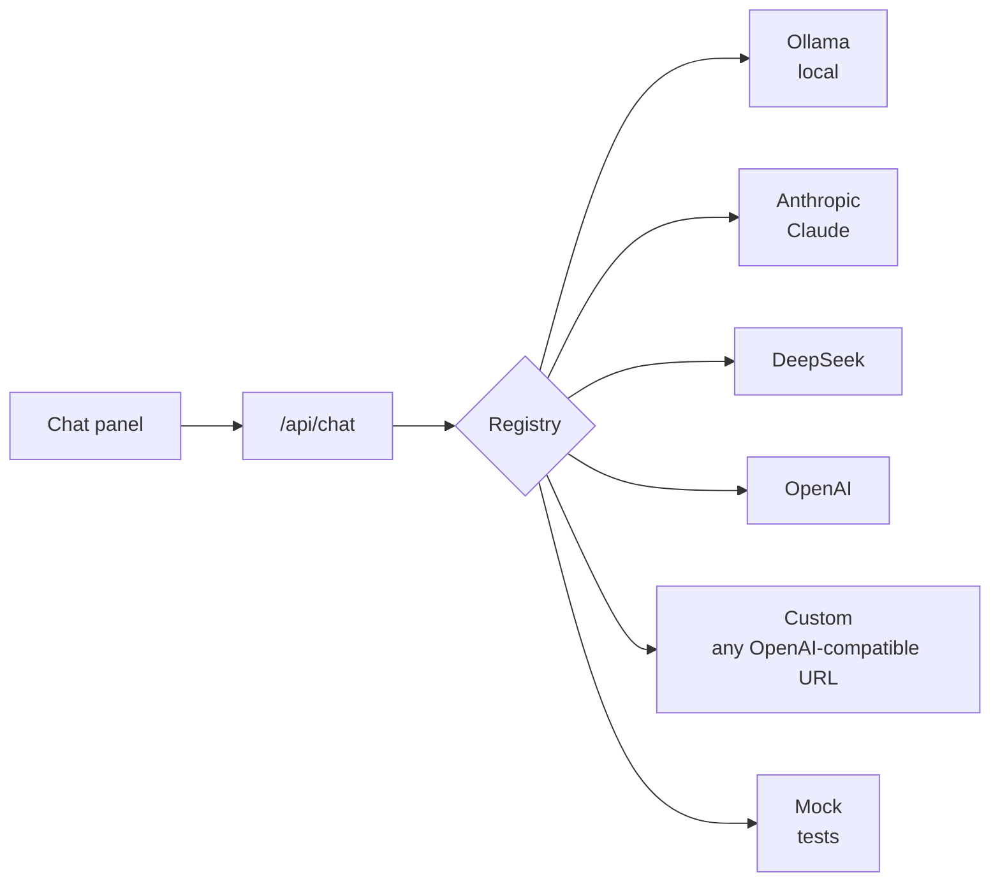

<div align="center">

# llm-finetune-lab

**A seven-stage QLoRA fine-tuning pipeline with a live ops console.**

Takes a messy support-ticket export all the way to a deployed local model you can chat with.

[](.github/workflows/ci.yml)
[](LICENSE)


</div>

---

## Contents

- [What it does](#what-it-does)
- [Tech stack](#tech-stack)
- [Architecture](#architecture)
- [The pipeline](#the-pipeline)
- [Why QLoRA](#why-qlora)
- [Quick start](#quick-start)
- [Providers](#providers)
- [Project structure](#project-structure)
- [Configuration](#configuration)
- [Testing](#testing)
- [Documentation](#documentation)
- [Author](#author)

---

## What it does

The training target is a small support assistant for **Nimbus**, a fictional note-taking app with an invented but internally consistent feature set (30-second sync, 30-day trash, Pro at 4.99/month). The default base model is **Qwen2.5-0.5B-Instruct**, small enough to run the whole thing on a laptop and big enough to visibly learn the domain. For real training runs the recommended base is **Qwen2.5-1.5B-Instruct** (see [Why QLoRA](#why-qlora)).

> [!NOTE]
> **Model licences.** This repo's code is MIT. The base models have their own licences: Qwen2.5-0.5B, 1.5B and 7B-Instruct are Apache-2.0. Qwen2.5-3B-Instruct is **not**: it uses the Qwen Research License (non-commercial), so this project avoids it. Check the licence of any model you swap in, and keep it with any fine-tuned weights you publish.

Every stage runs in two modes:

| Mode | What happens | Needs |
|---|---|---|
| **Dry run** | Every stage executes with zero downloads and zero GPU. Training and evaluation are simulated and labelled as simulated everywhere they appear. | Nothing beyond `pip install -e .` |
| **Real run** | Actual Hugging Face download, actual 4-bit QLoRA training, actual GGUF export and `ollama create`. | Training extras and a CUDA GPU |

The dry run is how you explore the app, and it is exactly what the test suite exercises end to end.

> [!WARNING]
> **Verification status.** The dry run is tested end to end in CI: all seven stages, the API, the CLI and the console. The **real** path has **not yet been verified in a real Colab or GPU run**. That covers downloading a base model, 4-bit QLoRA training, evaluating the adapter, merging, GGUF conversion and `ollama create`. Its logic is unit-tested without a GPU, but treat the first real run as a trial, and please open an issue with what you see.

---

## Tech stack

<p align="center">
  
</p>

| Layer | Technology | What it does here |
|---|---|---|
| **Training** |      | 4-bit NF4 base, LoRA adapters, paged 8-bit optimizer |
| **Models** |   | Base model download (`snapshot_download`) |
| **Export & serving** |   | Merged model to GGUF, registered as `nimbus-support` |
| **Backend** |      | REST API, typed settings, provider HTTP calls |
| **Frontend** |   | Ops console: pipeline rail, stage metrics, chat, health |
| **Chat providers** |     | A/B your fine-tune against hosted models |
| **Quality** |    | Tests on Python 3.11 and 3.12, lint, frontend build |
| **Free GPU** |   | Real QLoRA runs on a T4 via the notebook |

---

## Architecture



The code is split into four layers, and imports only point downward:

| Layer | Package | Responsibility |
|---|---|---|
| **Entry points** | `web/`, `api/`, `cli.py` | Take input from a person (browser or terminal), validate it, return status codes and readable errors. No business logic. |
| **Pipeline** | `pipeline/` | The seven stages, the single-flight runner, the atomic status file, and the QLoRA-or-LoRA decision. Knows nothing about HTTP. |
| **Providers** | `providers/` | One `chat(messages) -> ChatResult` interface over Ollama, Anthropic, and every OpenAI-compatible API. Knows nothing about the pipeline. |
| **Core** | `core/` | Settings, logging, error types, secret masking. Imports nothing else from the project, so every other layer can use it. |

Because `pipeline` never imports `api`, the CLI can drive a full run with no web server. The layer diagram, run sequence, HTTP API reference, and on-disk layout are in **[docs/architecture.md](docs/architecture.md)**.

---

## The pipeline



| # | Stage | What it does | Dry mode |
|---|---|---|---|
| 1 | **Ingest** | Reads `data/raw/*.jsonl`, drops malformed and incomplete rows with counts | identical |
| 2 | **Prepare** | Dedupes, drops one-word answers, converts to chat format, seeded train/val split | identical |
| 3 | **Pull base** | Snapshot-downloads the base model from Hugging Face | reports what it would pull |
| 4 | **Profile & plan** | Probes CUDA and bitsandbytes, picks QLoRA or LoRA, sizes the batch, estimates VRAM | identical, it is honest about your hardware |
| 5 | **Fine-tune** | 4-bit NF4 base, LoRA adapters on every linear layer, paged 8-bit optimizer, loss on the assistant's reply only | simulated loss curve, clearly labelled |
| 6 | **Evaluate** | Token-overlap F1 and keyword hit rate on the validation split (about 12 rows with the seed data, so read it as a sanity check, not a benchmark) | mock predictions, clearly labelled |
| 7 | **Export & deploy** | Merges the adapter at full precision, converts to GGUF, registers with Ollama | writes the Modelfile and a copy-pasteable plan |

---

## Why QLoRA

QLoRA is LoRA with the frozen base model quantized to 4-bit. The adapters still train in bf16 or fp16; only the weights you are not training get squeezed.



It is **not** a strict upgrade. You trade VRAM for step time, because every forward pass dequantizes on the fly:

| Base model | LoRA (bf16) | QLoRA (4-bit) | Worth it? |
|---|---|---|---|
| Qwen2.5-0.5B | ~2.4 GB | ~1.7 GB | Barely, and every step is slower |
| Qwen2.5-1.5B | ~4.3 GB | ~2.2 GB | Recommended for real runs: fits a free Colab T4 easily |
| Qwen2.5-7B | ~14.7 GB | ~4.9 GB | Yes, moves it from a 16 GB card to an 8 GB one |
| Llama-3.1-8B | ~16.6 GB | ~5.4 GB | Yes |

Numbers are the pipeline's own estimates (`finetune-lab plan`). QLoRA is the default here, and the profile stage falls back to LoRA **with a stated reason** on machines that cannot do 4-bit. The full reasoning, including the review of the original LoRA setup, is in **[docs/qlora.md](docs/qlora.md)**.

---

## Quick start

**Prerequisites:** Python 3.11+, Node 20.19+ (or 22.12+). For a real run: a CUDA GPU. Ollama is optional.

```bash
git clone https://github.com/asadaslam556/llm-finetune-lab.git
cd llm-finetune-lab
pip install -e ".[dev]"
npm install --prefix web
cp .env.example .env   # first time only: this overwrites an existing .env
```

Start the backend and the console in two terminals:

```bash
uvicorn finetune_lab.api.app:app --reload --port 8000
```

```bash
npm run dev --prefix web
```

Open **http://localhost:5173** and click **Start dry run**.

No browser handy, say on a rented GPU box? Everything works from the terminal too:

```bash
finetune-lab plan          # what a real run would do on this machine
finetune-lab run           # dry run, streamed to stdout
finetune-lab run --real    # the real thing
```

For a real run, add the training stack:

```bash
pip install -e ".[train,quant]"
```

No GPU at all? The [Colab notebook](notebooks/train_on_colab.ipynb) runs the real pipeline on a free T4. Step-by-step setup lives in **[docs/getting-started.md](docs/getting-started.md)**.

---

## Providers

The chat panel lets you A/B your fine-tune against hosted models. Switching providers is a `.env` edit, never a code change.



| Provider | Set in `.env` |
|---|---|
| `ollama` | nothing, just run `ollama serve` |
| `anthropic` | `ANTHROPIC_API_KEY`, optionally `ANTHROPIC_BASE_URL` for a gateway and `ANTHROPIC_MODEL` |
| `deepseek` | `DEEPSEEK_API_KEY` |
| `openai` | `OPENAI_API_KEY` |
| `custom` | `CUSTOM_API_KEY`, `CUSTOM_BASE_URL`, `CUSTOM_MODEL` (Together, Groq, OpenRouter, vLLM...) |
| `mock` | nothing |

> [!IMPORTANT]
> These are inference providers only. None of these APIs offer QLoRA fine-tuning, so training always happens on an open-weight model you download. See [docs/providers.md](docs/providers.md).

---

## Project structure

```
llm-finetune-lab/
├── src/finetune_lab/          # the installable Python package
│   ├── core/                  #   config, logging, error types (no app logic)
│   ├── providers/             #   chat backends behind one interface
│   ├── pipeline/              #   the seven stages and everything they share
│   │   ├── stages/            #     s1_ingest.py ... s7_export_deploy.py
│   │   ├── quantization.py    #     QLoRA vs LoRA decision, bnb config, VRAM math
│   │   ├── modeling.py        #     shared model and tokenizer loading
│   │   ├── runner.py          #     single-flight background runner
│   │   └── status.py          #     atomic JSON status file
│   ├── api/                   #   FastAPI app, routes, schemas, middleware
│   └── cli.py                 #   finetune-lab run | plan | serve
├── web/                       # React + Vite ops console
├── tests/                     # pytest, runs fully without a GPU
├── data/raw/                  # seed dataset
├── docs/                      # architecture, QLoRA, providers, credentials
├── notebooks/                 # Colab notebook for a free GPU
├── scripts/                   # seed data generator
├── pyproject.toml             # package, extras, tool config
└── .env.example               # every setting, documented
```

Layers only depend downward: `api` and `cli` call `pipeline` and `providers`, which call `core`. Details in [docs/architecture.md](docs/architecture.md).

---

## Configuration

Every setting is an env var with an `LFL_` prefix, readable from `.env`. Vendor-standard names (`ANTHROPIC_API_KEY`, `HF_TOKEN`, ...) work as fallbacks, so you never set a secret twice. The most useful knobs:

| Variable | Default | Purpose |
|---|---|---|
| `LFL_FINETUNE_STRATEGY` | `qlora` | `qlora` or `lora` |
| `LFL_BASE_MODEL_HF` | `Qwen/Qwen2.5-0.5B-Instruct` | use `Qwen/Qwen2.5-1.5B-Instruct` for real runs (Apache-2.0) |
| `LFL_QUANT_TYPE` | `nf4` | `nf4` or `fp4` |
| `LFL_LORA_R` | `16` | adapter rank |
| `LFL_NUM_EPOCHS` | `1` | |
| `LFL_BATCH_SIZE` | `4` | effective batch, split by the profile stage |
| `LFL_DEFAULT_PROVIDER` | `ollama` | chat panel default |

The complete list, with comments, is in [.env.example](.env.example).

---

## Testing

```bash
pytest
ruff check src tests
ruff format --check src tests
npm run build --prefix web
```

The suite covers all seven stages in dry mode, the QLoRA decision logic on simulated hardware, every provider against faked HTTP, the runner's locking and failure paths, and the health endpoint. None of it needs torch or a GPU, which is how CI runs it on a plain Ubuntu runner.

---

## Documentation

| Doc | Read it for |
|---|---|
| [Getting started](docs/getting-started.md) | Install, first dry run, first real run, Colab, troubleshooting |
| [QLoRA](docs/qlora.md) | LoRA vs QLoRA, the review of the old setup, memory math, gotchas |
| [Architecture](docs/architecture.md) | Layers, data flow, design decisions |
| [Providers](docs/providers.md) | Claude, DeepSeek, OpenAI, gateways, adding your own |
| [Credentials](docs/credentials.md) | Hugging Face tokens, Ollama, keeping secrets out of git |
| [Release checklist](docs/release-checklist.md) | Step-by-step checks and secret scan before any push or release |
| [Security](SECURITY.md) | What the API protects against, and how to report a problem |
| [Changelog](CHANGELOG.md) | What changed in each version, and known limitations |

---

## Author

Built and maintained by **Asad Aslam**.

Released under the [MIT License](LICENSE).
