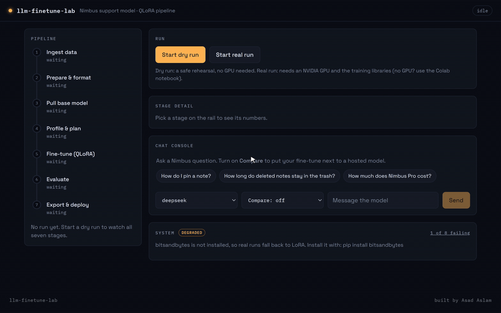
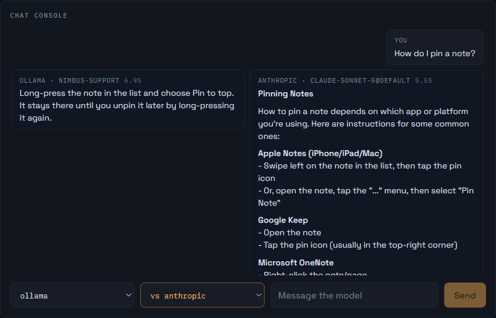
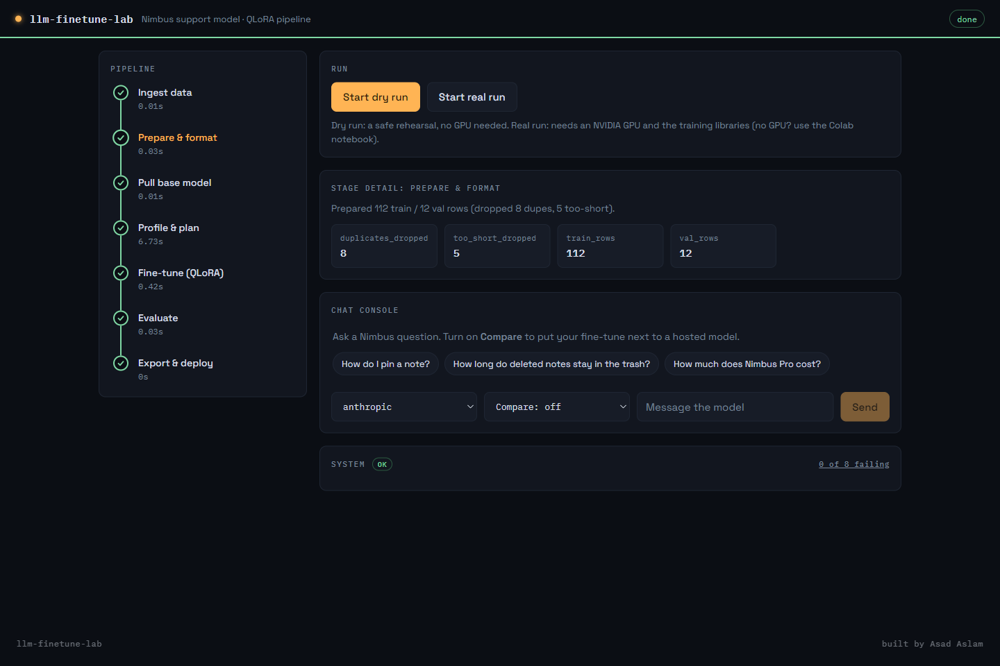
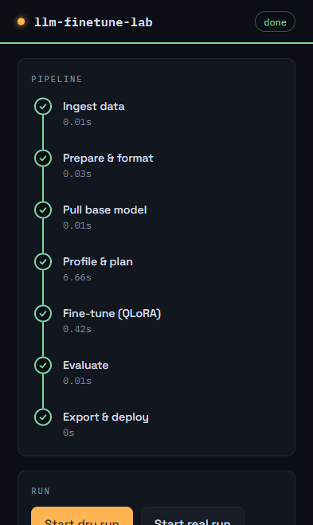

<div align="center">


# llm-finetune-lab

**A seven-stage QLoRA fine-tuning pipeline with a live ops console.**

Takes a messy support-ticket export all the way to a deployed local model you can chat with.

[](https://github.com/asadaslam556/llm-finetune-lab/actions/workflows/ci.yml)
[](LICENSE)
[](CHANGELOG.md)


</div>

---

## Demo



A dry run, the stage details, Compare mode with the fine-tuned `nimbus-support` next to DeepSeek, and the health checks, in about 25 seconds, played at double speed. [Download the full-quality video](docs/images/demo.mp4) (MP4, 1.3 MB, 1600×1000).

---

## Highlights

- **Seven stages, one command.** Ingest, prepare, pull base, profile, fine-tune, evaluate and export, from the console or `finetune-lab run`.
- **QLoRA by default, with an honest fallback.** A 4-bit NF4 base, LoRA on all seven linear layers and a paged 8-bit optimizer. When the machine cannot do 4-bit, it trains plain LoRA and says why.
- **Dry runs everywhere.** Every stage runs with no GPU and no downloads, and simulated numbers are labelled as simulated. CI tests the whole dry path on Python 3.11 and 3.12.
- **A live ops console.** A React 19 rail that fills as stages finish, per-stage metrics, and eight health checks.
- **Compare mode.** Ask your fine-tune and a hosted model (DeepSeek, Claude, OpenAI or any OpenAI-compatible API) the same question and read the answers side by side.
- **Local deployment, verified.** The adapter is merged at full precision, converted to GGUF with llama.cpp and registered in Ollama. The real path has run end to end on a free Colab T4 and Windows 11.

---

## Contents

- [Demo](#demo)
- [Highlights](#highlights)
- [What it does](#what-it-does)
- [Screenshots](#screenshots)
- [Tech stack](#tech-stack)
- [Architecture](#architecture)
- [The pipeline](#the-pipeline)
- [Why QLoRA](#why-qlora)
- [Quick start](#quick-start)
- [Usage](#usage)
- [Providers](#providers)
- [Configuration](#configuration)
- [Project structure](#project-structure)
- [Testing](#testing)
- [Deployment](#deployment)
- [Troubleshooting](#troubleshooting)
- [Documentation](#documentation)
- [License](#license)

---

## What it does

The training target is a small support assistant for **Nimbus**, a fictional note-taking app with an invented but internally consistent feature set (30-second sync, 30-day trash, Pro at 4.99 a month). The default base model is **Qwen2.5-0.5B-Instruct**, small enough to run the whole thing on a laptop and big enough to visibly learn the domain. Real training runs use **Qwen2.5-1.5B-Instruct** (see [Why QLoRA](#why-qlora)).

> [!NOTE]
> **Model licences.** This repo's code is MIT. The base models have their own licences: Qwen2.5-0.5B, 1.5B and 7B-Instruct are Apache-2.0. Qwen2.5-3B-Instruct is **not**: it uses the Qwen Research License (non-commercial), so this project avoids it. Check the licence of any model you swap in, and keep it with any fine-tuned weights you publish.

Every stage runs in two modes:

| Mode | What happens | Needs |
|---|---|---|
| **Dry run** | Every stage executes with zero downloads and zero GPU. Training and evaluation are simulated and labelled as simulated everywhere they appear. | `pip install -e .` |
| **Real run** | Actual Hugging Face download, actual 4-bit QLoRA training, actual GGUF export and `ollama create`. | Training extras and a CUDA GPU (or the Colab notebook) |

The dry run is how you explore the app, and it is what the test suite exercises end to end.

> [!NOTE]
> **Verification status.** CI tests the dry run end to end: all seven stages, the API, the CLI and the console. The real path has been run by hand:
>
> - 4-bit QLoRA training of Qwen2.5-1.5B on a free Colab T4 (84 steps, final loss 1.16, keyword hit rate 0.53), then the adapter merge, GGUF conversion and `ollama create` on Windows 11 without a GPU.
> - A second run with 6 epochs (168 steps, final loss **0.59**) answered **5 of 6** held-out fact questions correctly: trash kept 30 days, pin to top (up to 10 per notebook), Pro at 4.99 a month or 49 a year, sync every 30 seconds, 7 days of free version history. It got the free attachment limit wrong. A 1.5B model trained on about 110 tickets learns most facts, not all.
>
> CI cannot run the real path, because it needs a GPU.

---

## Screenshots

**Compare mode: the fine-tuned 1.5B model next to Claude.** Both got the same question. The fine-tune answers with the Nimbus-specific steps it was trained on; the hosted model, which has never seen Nimbus, has to guess across other apps.



**The ops console after a run.** The rail fills as each stage finishes, the header line tracks progress, and each stage shows its own numbers.



<details>
<summary>On a phone</summary>



</details>

---

## Tech stack

<p align="center">
  
</p>

| Layer | Technology | What it does here |
|---|---|---|
| **Training** |       | 4-bit NF4 base, LoRA adapters, paged 8-bit optimizer |
| **Models** |   | Base model download (`snapshot_download`) |
| **Export & serving** |   | Merged model to GGUF, registered as `nimbus-support` |
| **Backend** |      | REST API, typed settings, provider HTTP calls |
| **Frontend** |   | Ops console: pipeline rail, stage metrics, chat, health |
| **Chat providers** |     | Put your fine-tune next to a hosted model |
| **Quality** |     | Tests on Python 3.11 and 3.12, lint, frontend build, weekly updates |
| **Free GPU** |   | Real QLoRA runs on a T4 via the notebook |

---

## Architecture


The browser console and the `finetune-lab` CLI drive the same runner. The runner executes one run at a time in a background thread and records progress in `artifacts/status.json`, which it writes atomically. The console polls `GET /api/pipeline/status` every 1.5 s. Dashed edges, the Hugging Face download and the Ollama deploy, happen in real runs only.

The code is split into four layers, and imports only point downward:


| Layer | Package | Responsibility |
|---|---|---|
| **Entry points** | `web/`, `api/`, `cli.py` | Take input from a person (browser or terminal), validate it, return status codes and readable errors. No business logic. |
| **Pipeline** | `pipeline/` | The seven stages, the single-flight runner, the atomic status file, and the QLoRA-or-LoRA decision. Knows nothing about HTTP. |
| **Providers** | `providers/` | One `chat(messages) -> ChatResult` interface over Ollama, Anthropic, and every OpenAI-compatible API. Knows nothing about the pipeline. |
| **Core** | `core/` | Settings, logging, error types, secret masking. Imports nothing else from the project, so every other layer can use it. |

Because `pipeline` never imports `api`, the CLI can drive a full run with no web server. Request flows, status lifecycles and the HTTP API reference are in **[docs/architecture.md](docs/architecture.md)**.

---

## The pipeline


| # | Stage | What it does | Dry mode |
|---|---|---|---|
| 1 | **Ingest** | Reads `data/raw/*.jsonl`, drops malformed and incomplete rows with counts | identical |
| 2 | **Prepare** | Dedupes, drops one-word answers, converts to chat format, seeded train/val split | identical |
| 3 | **Pull base** | Snapshot-downloads the base model from Hugging Face | reports what it would pull |
| 4 | **Profile & plan** | Probes CUDA and bitsandbytes, picks QLoRA or LoRA, sizes the batch, estimates VRAM | identical: it is honest about your hardware |
| 5 | **Fine-tune** | 4-bit NF4 base, LoRA adapters on every linear layer, paged 8-bit optimizer, loss on the assistant's reply only | simulated loss curve, clearly labelled |
| 6 | **Evaluate** | Token-overlap F1 and keyword hit rate on the validation split (about 12 rows with the seed data, so read it as a sanity check, not a benchmark) | mock predictions, clearly labelled |
| 7 | **Export & deploy** | Merges the adapter at full precision, converts to GGUF, registers with Ollama | writes the Modelfile and a copy-pasteable plan |

Each run gets its own folder, `artifacts/<run_id>/`. Before a run starts, the runner checks that every stage you asked for has its input files, so a missing file is a 400 that names it instead of a failure halfway through.

---

## Why QLoRA

QLoRA is LoRA with the frozen base model quantized to 4-bit. The adapters still train in bf16 or fp16; only the weights you are not training get squeezed.


It is **not** a strict upgrade. You trade VRAM for step time, because every forward pass dequantizes on the fly:

| Base model | LoRA (bf16) | QLoRA (4-bit) | Worth it? |
|---|---|---|---|
| Qwen2.5-0.5B | ~2.4 GB | ~1.7 GB | Barely, and every step is slower |
| Qwen2.5-1.5B | ~4.3 GB | ~2.2 GB | Recommended for real runs: fits a free Colab T4 easily |
| Qwen2.5-7B | ~14.7 GB | ~4.9 GB | Yes, moves it from a 16 GB card to an 8 GB one |
| Llama-3.1-8B | ~16.6 GB | ~5.4 GB | Yes |

Numbers are the pipeline's own estimates (`finetune-lab plan`). QLoRA is the default, and the profile stage falls back to LoRA **with a stated reason** on machines that cannot do 4-bit. The full reasoning is in **[docs/qlora.md](docs/qlora.md)**.

---

## Quick start

**Prerequisites:** Python 3.11+, Node 20.19+ (or 22.12+), git. For a real run, a CUDA GPU or a Google account for Colab. Ollama is optional.

**1. Install**

```bash
git clone https://github.com/asadaslam556/llm-finetune-lab.git
cd llm-finetune-lab
python -m venv .venv
source .venv/bin/activate        # Windows PowerShell: .venv\Scripts\Activate.ps1
pip install -e ".[dev]"
npm install --prefix web
```

**2. Configure** (optional for a dry run)

```bash
cp .env.example .env             # first time only: this overwrites an existing .env
```

To chat with a hosted model, set a provider and its key in `.env`:

```env
LFL_DEFAULT_PROVIDER=deepseek
DEEPSEEK_API_KEY=<YOUR_API_KEY>
```

**3. Run.** Start the backend and the console in two terminals:

```bash
uvicorn finetune_lab.api.app:app --reload --port 8000
```

```bash
npm run dev --prefix web
```

Open **http://localhost:5173** and click **Start dry run**.

The [`Makefile`](Makefile) has the same commands as shortcuts (`make install`, `make api`, `make web`, `make test`, `make lint`). Step-by-step setup, including a real run on Colab, is in **[docs/getting-started.md](docs/getting-started.md)**.

---

## Usage

No browser handy, say on a rented GPU box? Everything works from the terminal:

```bash
finetune-lab plan                              # what a real run would do on this machine
finetune-lab run                               # dry run, streamed to stdout
finetune-lab run --stages evaluate             # re-run one stage in the latest run dir
finetune-lab run --real                        # the real thing
finetune-lab serve --port 8000                 # start the API on 127.0.0.1:8000
```

For a real run, add the training stack first:

```bash
pip install -e ".[train,quant]"
```

The same actions over HTTP while the API runs:

```bash
curl -X POST http://localhost:8000/api/pipeline/run -H "Content-Type: application/json" -d '{"dry_run": true}'
curl http://localhost:8000/api/pipeline/status
curl -X POST http://localhost:8000/api/chat -H "Content-Type: application/json" -d '{"provider": "deepseek", "messages": [{"role": "user", "content": "How do I pin a note?"}]}'
```

Interactive API docs are at **http://localhost:8000/docs** while the server runs.

---

## Providers

The chat panel puts your fine-tune next to hosted models: pick a provider, set **Compare** to a second one, and every question goes to both, answered side by side. Each provider keeps its own conversation history. Switching providers is a `.env` edit, never a code change.


| Provider | Set in `.env` |
|---|---|
| `ollama` | nothing, just run `ollama serve` |
| `deepseek` | `DEEPSEEK_API_KEY`, optionally `DEEPSEEK_MODEL` (default `deepseek-chat`) |
| `anthropic` | `ANTHROPIC_API_KEY`, optionally `ANTHROPIC_BASE_URL` for a gateway and `ANTHROPIC_MODEL` |
| `openai` | `OPENAI_API_KEY` |
| `custom` | `CUSTOM_API_KEY`, `CUSTOM_BASE_URL`, `CUSTOM_MODEL` (Together, Groq, OpenRouter, vLLM...) |
| `mock` | nothing |

> [!IMPORTANT]
> These are inference providers only. None of these APIs offer QLoRA fine-tuning, so training always happens on an open-weight model you download. See [docs/providers.md](docs/providers.md).

---

## Configuration

Every setting is an env var with an `LFL_` prefix, read from the shell or `.env`. Vendor-standard names (`DEEPSEEK_API_KEY`, `HF_TOKEN`, ...) work as fallbacks, so you never set a secret twice. A value in the shell beats `.env`.

| Variable | Default | Purpose |
|---|---|---|
| `LFL_DEFAULT_PROVIDER` | `ollama` | Chat provider the console preselects: `ollama`, `deepseek`, `anthropic`, `openai`, `custom`, `mock` |
| `LFL_BASE_MODEL_HF` | `Qwen/Qwen2.5-0.5B-Instruct` | Base model. Use `Qwen/Qwen2.5-1.5B-Instruct` for real runs |
| `LFL_OLLAMA_BASE_TAG` | `qwen2.5:0.5b-instruct` | Ollama tag of the same base, used before you deploy a fine-tune |
| `LFL_FINETUNE_STRATEGY` | `qlora` | `qlora` or `lora` |
| `LFL_QUANT_TYPE` | `nf4` | `nf4` or `fp4` |
| `LFL_LORA_R` | `16` | Adapter rank |
| `LFL_NUM_EPOCHS` | `1` | Passes over the training data |
| `LFL_BATCH_SIZE` | `4` | Effective batch, split by the profile stage |
| `LFL_MAX_SEQ_LEN` | `512` | Tokens per training example |
| `LFL_GGUF_CONVERT_SCRIPT` | empty | Path to llama.cpp's `convert_hf_to_gguf.py` |
| `LFL_ALLOWED_HOSTS` | `localhost,127.0.0.1` | Host names the API answers |
| `HF_TOKEN` | empty | Only for gated or private Hugging Face models |

Every setting, with comments, is in [.env.example](.env.example), and all of them are explained in [docs/getting-started.md](docs/getting-started.md#configuration-reference).

---

## Project structure

```
llm-finetune-lab/
├── src/finetune_lab/          # the installable Python package
│   ├── core/                  #   config, logging, error types (no app logic)
│   ├── providers/             #   chat backends behind one interface
│   ├── pipeline/              #   the seven stages and everything they share
│   │   ├── stages/            #     s1_ingest.py ... s7_export_deploy.py
│   │   ├── quantization.py    #     QLoRA vs LoRA decision, bnb config, VRAM math
│   │   ├── modeling.py        #     shared model and tokenizer loading
│   │   ├── runner.py          #     single-flight background runner
│   │   └── status.py          #     atomic JSON status file
│   ├── api/                   #   FastAPI app, routes, schemas, middleware
│   └── cli.py                 #   finetune-lab run | plan | serve
├── web/                       # React + Vite ops console
├── tests/                     # pytest, runs fully without a GPU
├── data/raw/                  # seed dataset (generated by scripts/)
├── notebooks/                 # Colab notebook for a free GPU
├── scripts/                   # seed data generator
├── docs/                      # architecture, getting started, providers, QLoRA
│   ├── images/                #   diagrams and screenshots
│   └── brand/                 #   logo and social card source
├── .github/                   # CI workflow, Dependabot, issue and PR templates
├── Makefile                   # shortcuts for install, run, test, lint
├── pyproject.toml             # package, extras, tool config
└── .env.example               # every setting, names only
```

---

## Testing

```bash
pytest
ruff check src tests
ruff format --check src tests
npm run build --prefix web
```

The suite covers all seven stages in dry mode, the QLoRA decision logic on simulated hardware, every provider against faked HTTP, the runner's locking and failure paths, and the health endpoint. None of it needs torch or a GPU, which is how CI runs it on a plain Ubuntu runner, on Python 3.11 and 3.12. The CI pipeline is drawn in [CONTRIBUTING.md](CONTRIBUTING.md#continuous-integration).

---

## Deployment


This is a local tool, so "deployment" means getting your fine-tune into Ollama on your own machine. There is no container or cloud configuration.

1. Train: `finetune-lab run --real` on an NVIDIA GPU, or the [Colab notebook](notebooks/train_on_colab.ipynb) on a free T4.
2. Export: stage 7 merges the adapter into a full-precision base, converts it to GGUF with llama.cpp and runs `ollama create nimbus-support`.
3. Chat: the Ollama provider switches to `nimbus-support` automatically (`artifacts/deployed.txt` records it).

The API has no login. Keep it on `127.0.0.1`; see [SECURITY.md](SECURITY.md). Full steps are in [docs/getting-started.md](docs/getting-started.md#6-export-and-deploy).

---

## Troubleshooting

| Symptom | Fix |
|---|---|
| Console says "backend offline" | Start uvicorn on port 8000 |
| `WinError 10013` or `address already in use` | Another program owns port 8000. Use `--port 8001` and start the console with `LFL_API_PORT=8001` |
| Profile says "downgraded from QLoRA" | Read the reason: usually no CUDA torch, or `pip install bitsandbytes` |
| Chat says the model "used the whole reply budget" | A reasoning model ran out of `LFL_MAX_OUTPUT_TOKENS`. Use `DEEPSEEK_MODEL=deepseek-chat` or raise the limit |
| Chat says "no key" or HTTP 401 | Put the key in `.env`, restart the API, and check no shell variable overrides it |
| Export cannot find the converter | Set `LFL_GGUF_CONVERT_SCRIPT` to the full path of `convert_hf_to_gguf.py` |

`GET http://localhost:8000/api/health` runs every check at once; the **System** panel shows the same. More fixes are in [docs/getting-started.md](docs/getting-started.md#troubleshooting).

---

## Documentation

| Doc | Read it for |
|---|---|
| [Getting started](docs/getting-started.md) | Install, first dry run, real run on a GPU or Colab, export to Ollama, every setting, troubleshooting |
| [Architecture](docs/architecture.md) | Layers, request flows, status lifecycles, run directory, HTTP API reference, design decisions |
| [Providers](docs/providers.md) | DeepSeek, Claude, OpenAI, gateways, Ollama, keys and adding your own |
| [QLoRA](docs/qlora.md) | LoRA vs QLoRA, how the plan is chosen, memory math, gotchas |
| [Contributing](CONTRIBUTING.md) | Setup, rules, checks, CI and the pre-push secret scan |
| [Security](SECURITY.md) | What the API protects against, keys, and how to report a problem |
| [Changelog](CHANGELOG.md) | What changed in each version |

---

## License

Released under the [MIT License](LICENSE). Built and maintained by **Asad Aslam**.
