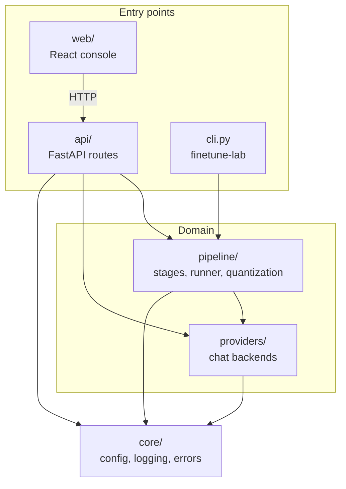
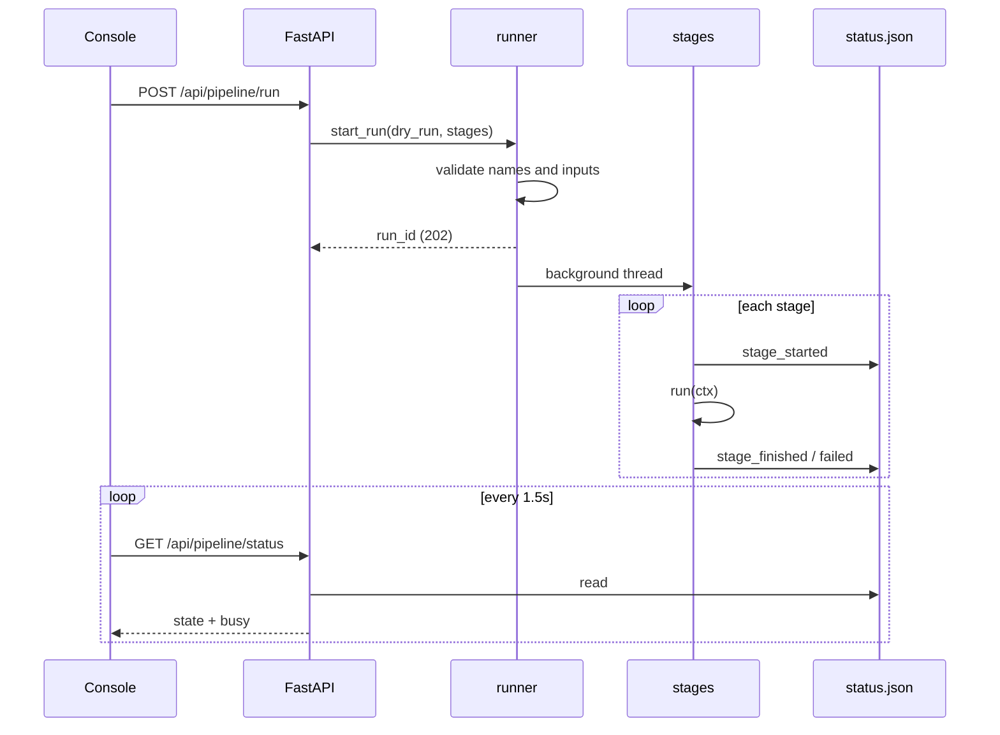
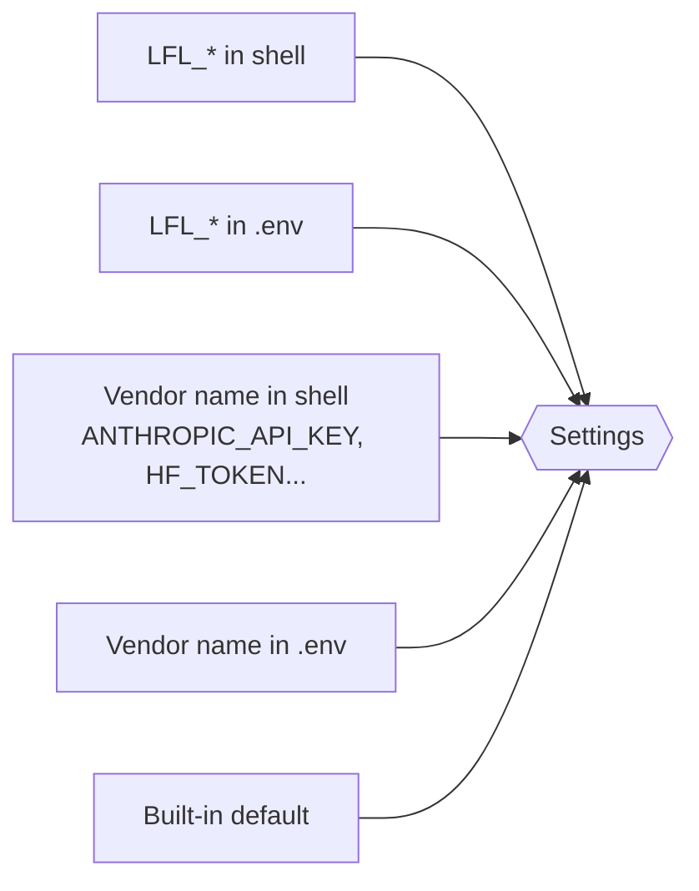

# Architecture


How the pieces fit, and why they are shaped the way they are.

---

## Layers



Dependencies only point downward. `core` imports nothing from the project, so anything can use it. `pipeline` never imports `api`, which is why the CLI can drive a run with no web server at all.

| Package | Owns | Must not |
|---|---|---|
| `core` | Settings, logger, error types, secret masking | Import anything else from the project |
| `providers` | One `chat()` interface over every backend | Know about the pipeline |
| `pipeline` | Stages, runner, status file, QLoRA decision | Know about HTTP |
| `api` | Validation, status codes, response shapes | Hold business logic |
| `cli.py` | Terminal entry point | Duplicate pipeline logic |

---

## A run, end to end



Validation happens in the caller's thread, so a bad stage name or missing input is a 400 straight away instead of a run that dies on its own a second later.

---

## Design decisions

**Stages are functions.** Each stage is `run(ctx) -> (message, metrics)`. No base class, no registry, no plugin system. A function is the easiest thing in the world to unit-test, and the runner stays a short loop.

**Status lives in a JSON file.** The runner writes from a background thread and the API reads from request handlers. A file is the simplest shared state that also survives a server restart. Writes are atomic (temp file plus `os.replace`) and retry on Windows sharing violations.

**One run at a time.** A single GPU cannot usefully train twice at once. A second start is a 409, not a queue.

**The plan is decided once.** Stage 4 writes `profile.json`, and every later stage reads it. Nothing downstream re-probes the hardware, so what the rail shows is what actually runs.

**Heavy imports are lazy.** `torch`, `transformers`, `peft` and `bitsandbytes` are only imported inside real-mode code paths. The API server and the whole dry run work without them, and the health check uses `importlib.util.find_spec` rather than importing a gigabyte of CUDA into a polled endpoint.

**Failures read like sentences.** A provider that is down returns HTTP 200 with `ok: false` and an explanation in the chat bubble. A stage that fails raises `StageError` with what to do next. Tracebacks go to the server log, never the UI.

**Dry runs are honest.** Simulated numbers are labelled simulated in the rail message, the metrics, and the files on disk. Nothing pretends a fake loss is real.

**No auth, on purpose.** The API can start training runs and has no login. It binds to `127.0.0.1` by default; keep it there, or put it behind a reverse proxy with auth before exposing it. Two guards cover the local case: requests are only answered for the host names in `LFL_ALLOWED_HOSTS` (default `localhost`, `127.0.0.1`), which blocks DNS-rebinding attacks from a browser tab. Chat requests are capped at 100 messages of 20,000 characters, because they are forwarded to paid APIs.

---

## Stage contract

Each stage reads files an earlier stage wrote into the run directory. The runner checks this table before starting, so a subset run with a missing input is rejected with a 400 that names the missing file.

| # | Stage | Needs | Writes | Real mode only needs |
|---|---|---|---|---|
| 1 | `ingest` | `data/raw/*.jsonl` | `ingested.jsonl` | |
| 2 | `prepare` | `ingested.jsonl` | `train.jsonl`, `val.jsonl` | |
| 3 | `pull_base` | | `artifacts/models/<model>/` (real mode) | network, HF token for gated models |
| 4 | `profile` | `train.jsonl` | `profile.json` | |
| 5 | `finetune` | `train.jsonl`, `profile.json` | `adapter/` | torch, CUDA for QLoRA |
| 6 | `evaluate` | `val.jsonl` | `eval_report.json` | `adapter/` |
| 7 | `export_deploy` | | `Modelfile`, `DEPLOY_PLAN.md` | `adapter/`, llama.cpp, Ollama |

The source of truth is `STAGE_INPUTS` and `STAGE_OUTPUTS` in `pipeline/status.py`.

---

## HTTP API

Interactive docs are at **http://localhost:8000/docs** (Swagger) while the server runs.

| Method | Path | Returns | Notes |
|---|---|---|---|
| `GET` | `/api/health/live` | `{status, app, version}` | Liveness. Touches no dependencies. |
| `GET` | `/api/health` | status, failing checks, config echo, 8 timed checks | 503 when a required check fails, 200 with `degraded` for optional ones |
| `GET` | `/api/providers` | `[{name, configured, default_model, note, default}]` | Feeds the chat picker. No network calls. |
| `POST` | `/api/chat` | `{ok, provider, model, reply, latency_ms, error_kind}` | Provider outages come back as 200 with `ok: false`. Unknown provider is 400. |
| `POST` | `/api/pipeline/run` | `{run_id, dry_run, stages, run_dir}` | 202 on start, 409 when busy, 400 on bad stages or missing inputs |
| `GET` | `/api/pipeline/status` | status file contents plus `busy` | Polled by the console every 1.5 s |

Every response carries `X-Request-ID` and `X-Response-Time-Ms`. A 500 includes the request id, which matches a line in the server log.

---

## Frontend

The console in `web/` is plain React with no state library. `App.jsx` polls `/api/pipeline/status` and passes the result down.

| Component | Shows |
|---|---|
| `PipelineRail` | The seven stages as nodes. The running stage ticks elapsed time from the server's start timestamp, so a reload does not reset the clock. |
| `RunControls` | Start dry run and Start real run. Disabled while the backend's lock says busy. |
| `StageDetail` | Message and metrics for the selected or running stage |
| `ChatPanel` | Provider picker, preselected on `LFL_DEFAULT_PROVIDER`, and chat transcript |
| `SystemHealth` | `/api/health` results, refreshed every 15 s. Keeps the check details on a 503, which is when you need them. |

`lib/api.js` wraps `fetch` and turns FastAPI error bodies, including validation arrays, into one readable sentence. In development, Vite proxies `/api` to port 8000, so the frontend needs no config.

---

## Configuration resolution



For each credential the first non-empty value wins, in the order above. Non-credential settings only read the `LFL_*` names. `.env` is looked up in the working directory and the repo root.

---

## Artifacts on disk

Every run gets its own directory:

```
artifacts/
├── status.json                  # live state, read by the console
├── deployed.txt                 # set after a real deploy, flips the Ollama default
├── models/Qwen__Qwen2.5-0.5B-Instruct/   # base model snapshot, shared across runs
└── 20260921-120317-d03286/
    ├── ingested.jsonl
    ├── train.jsonl, val.jsonl
    ├── profile.json             # hardware + QLoRA plan + VRAM estimate
    ├── adapter/                 # LoRA weights + ADAPTER_INFO.json
    ├── eval_report.json
    ├── merged/                  # real mode only
    ├── model.gguf               # real mode only
    ├── Modelfile
    └── DEPLOY_PLAN.md
```

A run that skips `ingest` continues in the previous run's directory, so re-running only `evaluate` works without redoing everything.

---

## Extending it

| To add | Do this |
|---|---|
| An OpenAI-compatible provider | Subclass `OpenAICompatible` with a `creds_attr`, add a resolver to `Settings`, register it in `providers/registry.py`. About ten lines. |
| A new stage | Write `run(ctx)`, add it to `STAGE_ORDER`, `STAGE_LABELS`, `STAGE_INPUTS`, `STAGE_OUTPUTS` and `STAGE_FUNCS`. |
| A new metric | Add a function in `s6_evaluate.py` and put it in the report dict. |

Known next steps, deliberately left out for now:

- Stream loss from the trainer into the status file for a live curve
- Upload the adapter to the Hugging Face Hub as an optional final stage

---

<sub>Maintained by Asad Aslam.</sub>
