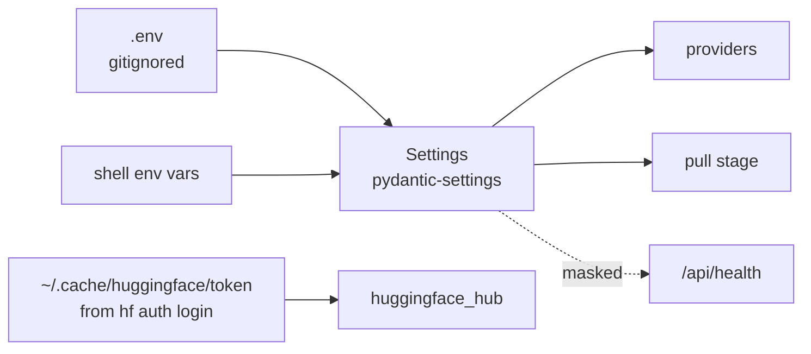

# Credentials


Getting credentials, storing them safely, and wiring them in.

> [!TIP]
> **For the project as it ships, you need neither a Hugging Face token nor an Ollama key.** Qwen2.5-0.5B-Instruct is public, and Ollama runs locally with no account. You only need a cloud API key if you want to chat with a hosted model.

---

## How secrets flow



Keys never appear in logs or API responses. The health endpoint shows `hf_Abc...7654` at most, and a test asserts the full token never leaks.

---

## Hugging Face

### Do you need a token?

| Situation | Token? |
|---|---|
| Public models: Qwen, Mistral, most of the Hub | No |
| Gated models: Llama, Gemma | Yes, plus accepting the licence on the model page |
| Private repos, including your own | Yes |
| Uploading a trained adapter | Yes, with write access |

### Getting one

1. Sign up at [huggingface.co/join](https://huggingface.co/join) and **verify your email**. An unverified email gives 401s that look exactly like a bad token.
2. Open [huggingface.co/settings/tokens](https://huggingface.co/settings/tokens) and click **Create new token**.
3. Pick **Fine-grained** (or **Read** if you just want downloads). Name it after where it will live, like `laptop-read` or `colab-read`, so you can revoke one without breaking the others.
4. Copy it now. It starts with `hf_` and you cannot view it again.

### Using it

The simplest option on your own machine:

```bash
pip install -U huggingface_hub
hf auth login
hf auth whoami
```

That stores the token in `~/.cache/huggingface/token` and every HF library finds it automatically. Or put it in `.env`:

```env
HF_TOKEN=hf_...
```

On Colab, use the key icon in the left sidebar, add a secret called `HF_TOKEN`, and enable notebook access. The notebook reads it from there.

### Gated models

Open the model page (for example [meta-llama/Llama-3.2-1B-Instruct](https://huggingface.co/meta-llama/Llama-3.2-1B-Instruct)), accept the licence, wait for approval, then:

```env
LFL_BASE_MODEL_HF=meta-llama/Llama-3.2-1B-Instruct
```

If the download fails, the pull stage tells you whether it is a missing token or unaccepted terms.

### Disk space

Models cache in `~/.cache/huggingface/hub` and the pull stage also snapshots into `artifacts/models/`. Clean up with:

```bash
hf cache scan
hf cache delete
```

---

## Ollama

No key, no account, nothing to leak. Install from [ollama.com/download](https://ollama.com/download), then:

```bash
ollama --version
ollama pull qwen2.5:0.5b-instruct
curl http://localhost:11434/api/tags
```

Leave `OLLAMA_HOST` on localhost. Ollama has no authentication, so binding it to `0.0.0.0` exposes it to your whole network.

---

## Cloud API keys

See [providers.md](providers.md) for each provider's variables. The rules are the same for all of them:

1. **Keys live in `.env` or the shell environment, never in code.** Quick tests are exactly what gets committed.
2. **`.env` is gitignored.** It is in `.gitignore` already; check with `git check-ignore .env` before your first commit.
3. **`.env.example` has the names, never the values.** It is what someone cloning the repo reads.
4. **One key per place it is used.** Laptop, Colab, CI. Revoking one should not break the rest.

### Before you push

Run a secret scanner once, it takes seconds:

```bash
pip install detect-secrets
detect-secrets scan
```

or [gitleaks](https://github.com/gitleaks/gitleaks) as a pre-commit hook.

### If a key leaks

1. **Revoke it first**, at the provider's dashboard. That is the step that matters.
2. Issue a replacement and update `.env`.
3. Clean git history afterwards if needed. Deleting the commit alone does not help; a public repo gets scraped within minutes.

This applies to keys pasted into chats, tickets and screenshots too, not only git.

---

## Quick reference

| I want to | Do this |
|---|---|
| Get an HF token | [huggingface.co/settings/tokens](https://huggingface.co/settings/tokens), Create new token |
| Log in on this machine | `hf auth login` |
| Use a gated model | Accept terms on the model page, then set `HF_TOKEN` |
| Check what the app sees | System panel, or `GET /api/health` |
| Switch chat provider | Change `LFL_DEFAULT_PROVIDER` in `.env`, restart the API |

---

<sub>Maintained by Asad Aslam.</sub>
