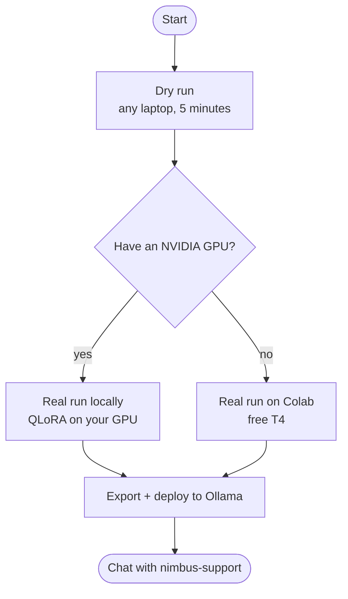

# Getting started


From a fresh clone to a fine-tuned model you can chat with.

---

## Pick your path



---

## 1. Install

You need **Python 3.11+** and **Node 20.19+** (or 22.12+, which Vite 8 requires).

```bash
git clone https://github.com/asadaslam556/llm-finetune-lab.git
cd llm-finetune-lab
python -m venv .venv
```

Activate it (`source .venv/bin/activate` on macOS and Linux, `.venv\Scripts\activate` on Windows), then:

```bash
pip install -e ".[dev]"
npm install --prefix web
cp .env.example .env   # first time only: this overwrites an existing .env
```

This is the light install: API, console, and the whole pipeline in dry mode. No torch.

> [!TIP]
> **On Windows PowerShell**, activate with `.venv\Scripts\Activate.ps1`. If it says running scripts is disabled, run `Set-ExecutionPolicy -Scope CurrentUser RemoteSigned` once and try again. `cp` works in PowerShell; in the old `cmd.exe` use `copy .env.example .env`. If `python` opens the Microsoft Store, use `py` instead.

---

## 2. First dry run

Start the API:

```bash
uvicorn finetune_lab.api.app:app --reload --port 8000
```

In a second terminal, the console:

```bash
npm run dev --prefix web
```

Open **http://localhost:5173**, click **Start dry run**, and watch the seven stages go green. Click any stage for its metrics. The **Profile & plan** stage tells you whether this machine could run real QLoRA, and why not if it cannot.

Prefer the terminal?

```bash
finetune-lab run
```

---

## 3. Chat with a model

The chat panel works before you train anything. Set a provider in `.env` and restart the API:

```env
LFL_DEFAULT_PROVIDER=anthropic
ANTHROPIC_API_KEY=your-key
```

or run Ollama locally with no key at all:

```bash
ollama pull qwen2.5:0.5b-instruct
```

All providers are covered in [providers.md](providers.md).

---

## 4. Real run on your own GPU

> [!WARNING]
> The real training path has not yet been verified end to end on a GPU. See the verification status note in the [README](../README.md#what-it-does).

Install the training stack, including bitsandbytes for 4-bit:

```bash
pip install -e ".[train,quant]"
```

Check the plan before committing twenty minutes to it:

```bash
finetune-lab plan
```

You want `"strategy": "qlora"` and `"downgraded": false`. If it downgraded, the `reason` field says what is missing. Then:

```bash
finetune-lab run --real
```

or click **Start real run** in the console.

> [!NOTE]
> On Windows, bitsandbytes 0.43 and later ship native wheels, so `pip install bitsandbytes` works directly. Make sure your torch build has CUDA: `python -c "import torch; print(torch.cuda.is_available())"` should print `True`.

---

## 5. Real run on Colab

No NVIDIA GPU? Open [`notebooks/train_on_colab.ipynb`](../notebooks/train_on_colab.ipynb) in Colab, switch the runtime to a T4, and run the cells. It clones this repo, trains **Qwen2.5-1.5B-Instruct** (Apache-2.0) with the same pipeline code, and hands you a zip of the adapter (a few MB).

Back on your machine, set the **same base model** in `.env`, or the merge will fail:

```env
LFL_BASE_MODEL_HF=Qwen/Qwen2.5-1.5B-Instruct
LFL_OLLAMA_BASE_TAG=qwen2.5:1.5b-instruct
```

Then:

```bash
pip install -e ".[train]"
finetune-lab run
```

Unzip the adapter into the newest `artifacts/<run-id>/adapter/`, then:

```bash
finetune-lab run --real --stages export_deploy
```

---

## 6. Export and deploy

The export stage needs two external tools:

1. **llama.cpp**, for the GGUF conversion:

   ```bash
   git clone https://github.com/ggml-org/llama.cpp
   pip install -r llama.cpp/requirements.txt
   ```

   Then point the project at the converter in `.env`:

   ```env
   LFL_GGUF_CONVERT_SCRIPT=/path/to/llama.cpp/convert_hf_to_gguf.py
   ```

2. **Ollama**, from [ollama.com/download](https://ollama.com/download).

When it finishes, the Ollama provider switches to your model automatically:

```bash
ollama run nimbus-support
```

If a tool is missing, the stage fails with instructions and leaves `DEPLOY_PLAN.md` with the exact commands to finish by hand.

---

## Stopping safely

- Press **Ctrl + C** in each terminal (backend and console). Wait for the prompt to come back.
- Stopping the backend in the middle of a run is safe. The status file is written atomically, and the next run starts cleanly. The interrupted run just stays unfinished on disk under `artifacts/`.
- Nothing needs to be shut down in any particular order.

## Common mistakes

| Mistake | What happens | Do this instead |
|---|---|---|
| Running `cp .env.example .env` when `.env` already exists | Your real keys are overwritten | Run it only the first time |
| Starting both servers in one terminal | The first one blocks the second | One terminal each |
| Opening http://localhost:8000 | You see the API docs, not the app | Open http://localhost:5173 |
| Editing `.env` without restarting the backend | Nothing changes | Ctrl + C, then start uvicorn again |
| Forgetting to activate the venv | `No module named uvicorn` | `.venv\Scripts\Activate.ps1` (Windows) or `source .venv/bin/activate` |
| A different base model in `.env` than on Colab | The merge in the export stage fails | Use the same `LFL_BASE_MODEL_HF` in both places |
| Pasting a key into an issue, chat or screenshot | The key is exposed | Revoke it at the provider immediately |

## Troubleshooting

| Symptom | Fix |
|---|---|
| Console says "backend offline" | Start uvicorn on port 8000 |
| `WinError 10013` or `address already in use` when starting uvicorn | Something else owns port 8000 (often a Docker container: check `docker ps`). Stop it, or start uvicorn with `--port 8001` and start the console with `LFL_API_PORT=8001` set (PowerShell: `$env:LFL_API_PORT="8001"`) |
| Profile says "downgraded from QLoRA" | Read the reason. Usually no CUDA torch, or `pip install bitsandbytes` |
| `CUDA out of memory` | `LFL_BATCH_SIZE=1`, or `LFL_MAX_SEQ_LEN=256`. On LoRA, switching to QLoRA helps most |
| Loss is `nan` on an older GPU | Should not happen with the kbit prep step; if it does, try `LFL_COMPUTE_DTYPE=float16` explicitly and report it |
| Pull stage 401 or 403 | Gated model. Accept the licence on the model page and set `HF_TOKEN` |
| Chat says "no key" | Put the key in `.env` and restart the API |
| Chat says "could not reach" a gateway | Check the base URL and whether you need a VPN or proxy for it |
| Export cannot find the converter | Set `LFL_GGUF_CONVERT_SCRIPT` to the full file path |

`GET http://localhost:8000/api/health` runs every check at once. The **System** panel in the console shows the same thing.

---

## Running the tests

```bash
pytest
ruff check src tests
ruff format --check src tests
npm run build --prefix web
```

No GPU or torch needed. CI runs these same four checks.

---

<sub>Maintained by Asad Aslam.</sub>
