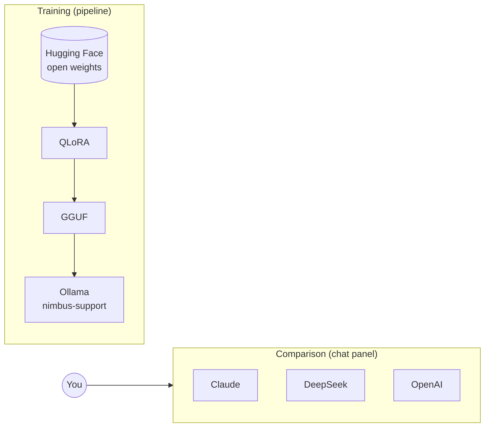

# Providers


The chat panel talks to a model through a provider. Switching provider is a `.env` edit.

---

## What providers are for

> [!IMPORTANT]
> Providers are for **chatting with** models, not training them. None of these hosted APIs expose a QLoRA or LoRA fine-tuning endpoint for their chat models. Training always happens in the pipeline on an open-weight model from Hugging Face.



The typical loop: ask the same Nimbus question to your fine-tune and to Claude or DeepSeek, and see how close a 0.5B model trained on about 110 tickets gets to a frontier model.

---

## Setup per provider

### Anthropic (Claude)

```env
LFL_DEFAULT_PROVIDER=anthropic
ANTHROPIC_API_KEY=your-key
ANTHROPIC_MODEL=claude-sonnet-5
```

To route through a gateway (corporate proxy, LiteLLM, or any Anthropic-compatible endpoint), add the base URL. Requests go to `{base}/v1/messages` with the same body and headers:

```env
ANTHROPIC_BASE_URL=https://your-gateway.example.com
ANTHROPIC_MODEL=claude-sonnet-5@default
```

Model names with gateway suffixes like `@default` are passed through untouched.

### DeepSeek

```env
LFL_DEFAULT_PROVIDER=deepseek
DEEPSEEK_API_KEY=sk-...
DEEPSEEK_MODEL=deepseek-chat
```

Keys come from [platform.deepseek.com](https://platform.deepseek.com). `deepseek-reasoner` also works as the model.

### OpenAI

```env
OPENAI_API_KEY=sk-...
OPENAI_MODEL=gpt-4o-mini
```

### Anything else OpenAI-compatible

Together, Groq, OpenRouter, Fireworks, a local vLLM or LM Studio server. Three variables and the `custom` provider appears in the picker:

```env
LFL_DEFAULT_PROVIDER=custom
CUSTOM_API_KEY=...
CUSTOM_BASE_URL=https://api.together.xyz/v1
CUSTOM_MODEL=meta-llama/Llama-3.3-70B-Instruct-Turbo
LFL_CUSTOM_LABEL=Together
```

The base URL should end where OpenAI's does, at `/v1`.

### Ollama

No key. Install from [ollama.com](https://ollama.com/download), then:

```bash
ollama pull qwen2.5:0.5b-instruct
```

After a real deploy the default Ollama model switches to your fine-tune automatically.

---

## Naming rules

Each credential can be set two ways. The project's own namespace wins; the vendor's standard name is the fallback:

| Setting | Namespaced | Standard fallback |
|---|---|---|
| Anthropic key | `LFL_ANTHROPIC_API_KEY` | `ANTHROPIC_API_KEY` |
| Anthropic URL | `LFL_ANTHROPIC_BASE_URL` | `ANTHROPIC_BASE_URL` |
| DeepSeek key | `LFL_DEEPSEEK_API_KEY` | `DEEPSEEK_API_KEY` |
| OpenAI key | `LFL_OPENAI_API_KEY` | `OPENAI_API_KEY` |
| HF token | `LFL_HF_TOKEN` | `HF_TOKEN` |

If you already export the standard names for the official SDKs, there is nothing to configure.

---

## Checking it works

> [!TIP]
> **A setting in your shell beats `.env`.** If `ANTHROPIC_BASE_URL` (or any key) is also set as an environment variable, for example by another tool, that value wins. Error messages name the server that answered (`... at api.anthropic.com returned HTTP 401`). If that isn't the server in your `.env`, clear the variable in that terminal with `Remove-Item Env:ANTHROPIC_BASE_URL` (PowerShell) or `unset ANTHROPIC_BASE_URL`, then restart the backend.

```bash
curl http://localhost:8000/api/providers
```

Each entry shows `configured: true/false`. The **System** panel in the console shows the same, with keys masked. A misconfigured provider still answers in the chat panel, with a sentence saying what is missing.

---

## Adding a named provider

```python
# providers/openai_compatible.py
class GroqProvider(OpenAICompatible):
    name = "groq"
    service = "the Groq API"
    creds_attr = "groq"
    note = "Llama and Mixtral on Groq. Needs GROQ_API_KEY."
```

Then add a `groq()` resolver to `Settings` and one line to `_FACTORIES` in `registry.py`.

---

<sub>Maintained by Asad Aslam.</sub>
