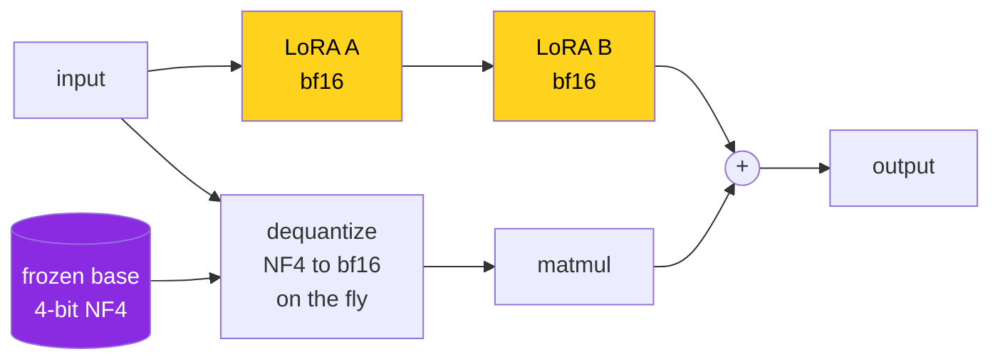
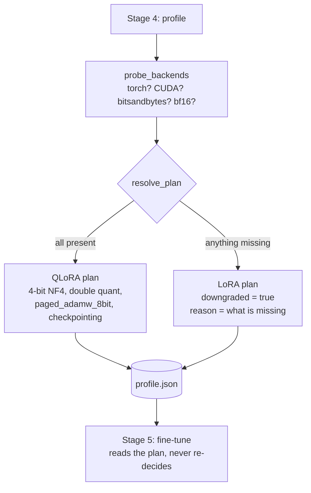

# QLoRA in this project


This page covers what the project did with LoRA before, whether QLoRA works here, what changed, and the traps worth knowing about.

---

## 1. Review of the original LoRA setup

The v1 pipeline trained plain LoRA with `transformers` and `peft`:

| Setting | v1 value | Verdict |
|---|---|---|
| Base precision | bf16 on Ampere+, fp32 on older cards | Correct. The fp32 load on fp16 hardware avoided the "unscale FP16 gradients" crash, which is a real and common bug. |
| Rank / alpha / dropout | 16 / 32 / 0.05 | Sensible defaults, kept as is. |
| Target modules | `q_proj k_proj v_proj o_proj` (attention only) | **The weak spot.** Skipping the MLP projections leaves most of the model's parameters untouched. |
| Optimizer | `adamw_torch` (Trainer default) | Fine for 0.5B, wasteful on anything bigger. |
| Gradient checkpointing | off | Fine for 0.5B, needed for anything bigger. |
| Export | merge adapter into a full-precision base, then GGUF | Correct, and it is exactly the step QLoRA users get wrong. Kept. |

Overall the v1 code was solid: lazy imports, honest dry-run labelling, good error messages. The two real gaps were the attention-only targeting and having no path to models bigger than about 3B on consumer hardware.

---

## 2. Does QLoRA work here?

**Yes, and it is now the default.** With one honest caveat about the default model size.

QLoRA is LoRA with the frozen base quantized to 4-bit NormalFloat (NF4). The adapters themselves still train in bf16 or fp16. It is not a newer replacement for LoRA so much as LoRA plus a memory trick.



Gradients only flow through the yellow boxes. The purple box never changes, so squeezing it to 4-bit costs very little quality.

### The trade you are making

| | LoRA | QLoRA |
|---|---|---|
| Base weight memory | 2 bytes/param | ~0.5 bytes/param |
| Step speed | baseline | roughly 20 to 40% slower (dequantize on every forward pass) |
| Quality | baseline | within noise on most benchmarks (per the QLoRA paper) |
| Hardware | any GPU, even CPU for smoke tests | **CUDA only** |
| Extra dependency | none | `bitsandbytes` |

### The caveat

The default base model is **0.5B parameters**. Its weights are about 1 GB in bf16. That was never what filled your GPU, so quantizing it saves under a gigabyte and costs you step time. QLoRA pays off from about 7B up:

| Base model | LoRA estimate | QLoRA estimate | Saving | Licence |
|---|---|---|---|---|
| Qwen2.5-0.5B | 2.4 GB | 1.7 GB | 0.7 GB | Apache-2.0 |
| Qwen2.5-1.5B | 4.3 GB | 2.2 GB | 2.1 GB | Apache-2.0 |
| Qwen2.5-3B | 7.2 GB | 3.0 GB | 4.2 GB | Qwen Research (non-commercial) |
| Qwen2.5-7B | 14.7 GB | 4.9 GB | 9.8 GB | Apache-2.0 |
| Llama-3.1-8B | 16.6 GB | 5.4 GB | 11.2 GB | Llama 3.1 Community |

These come from `finetune-lab plan` and are deliberately rough (weights plus adapters plus optimizer state plus a flat allowance for activations). To get the real benefit, set:

```env
LFL_BASE_MODEL_HF=Qwen/Qwen2.5-7B-Instruct
LFL_OLLAMA_BASE_TAG=qwen2.5:7b-instruct
```

The 0.5B default stays so the full pipeline still runs on a laptop and in CI.

---

## 3. What changed



| Area | Change |
|---|---|
| `pipeline/quantization.py` | **New.** Probes the machine, picks QLoRA or LoRA, builds the `BitsAndBytesConfig`, estimates VRAM. |
| Stage 4, profile | Writes the full plan, including the reason for any downgrade, into `profile.json`. The reason shows on the pipeline rail. |
| Stage 5, fine-tune | Loads the base in 4-bit, runs `prepare_model_for_kbit_training`, enables non-reentrant gradient checkpointing, uses a paged 8-bit optimizer. |
| Target modules | Now all seven linear layers: attention plus `gate_proj up_proj down_proj`. |
| Stage 6, evaluate | Loads the base in 4-bit too, so you evaluate what you trained. |
| Stage 7, export | Unchanged in logic: still merges at full precision. Now documented as a hard rule. |
| Health endpoint | New `training.quantization` check. |
| Config | New `LFL_FINETUNE_STRATEGY`, `LFL_QUANT_BITS`, `LFL_QUANT_TYPE`, `LFL_DOUBLE_QUANT`, `LFL_COMPUTE_DTYPE`, `LFL_GRADIENT_CHECKPOINTING`, `LFL_OPTIMIZER`. |

### Why the fallback exists

QLoRA needs a CUDA GPU and `bitsandbytes`. A hard requirement would break the dry run on a Mac, CI on a CPU runner, and every contributor without an NVIDIA card. So the pipeline asks for QLoRA and, when the machine cannot do it, trains plain LoRA and says so:

```
LORA (downgraded from QLoRA) on cpu/float32, batch 1x4, ~10 steps. no GPU detected.
No CUDA device. 4-bit kernels need one, so this falls back to LoRA.
```

A downgrade is never silent. It is in the rail message, in `profile.json`, and in the health check. Set `LFL_FINETUNE_STRATEGY=lora` to opt out of QLoRA on purpose.

---

## 4. Gotchas this code handles

**Merging into a 4-bit base.** Merging adds the adapter delta into the base weights, and 4-bit weights cannot hold that precision. The export stage reloads the base at full precision, merges there, then quantizes once with llama.cpp. *Train in 4-bit, merge in 16-bit, ship in GGUF.*

**Skipping `prepare_model_for_kbit_training`.** It upcasts layer norms and the output head to fp32. Without it, fp16 runs tend to go to NaN within a few dozen steps.

**Reentrant gradient checkpointing.** With PEFT the reentrant version throws "none of the inputs have requires_grad". The code passes `use_reentrant=False`.

**CPU offload.** bitsandbytes cannot train layers that `accelerate` pushed to CPU or disk. The model is pinned with `device_map={"": 0}` so it fails fast at load time instead of twenty minutes in.

**Paged optimizer without bitsandbytes.** `paged_adamw_8bit` is a bitsandbytes feature. On the LoRA fallback path without bnb, the plan switches to `adamw_torch`.

**Training on the prompt.** Every row starts with the same system prompt. Scoring the loss over it teaches the model to recite that prompt, not to answer. `build_example` in stage 5 masks everything before the assistant turn, and `DataCollatorForSeq2Seq` keeps that mask when padding (the language-modeling collator would quietly overwrite it).

**Pre-Ampere GPUs.** T4, V100, RTX 20xx have no bf16. Compute dtype falls back to fp16, which is the path the Colab notebook takes.

---

## 5. Running it

```bash
pip install -e ".[train,quant]"
finetune-lab plan           # check the plan says "qlora" and downgraded: false
finetune-lab run --real
```

Checking bitsandbytes can see your GPU:

```bash
python -m bitsandbytes
```

---

<sub>Maintained by Asad Aslam.</sub>
